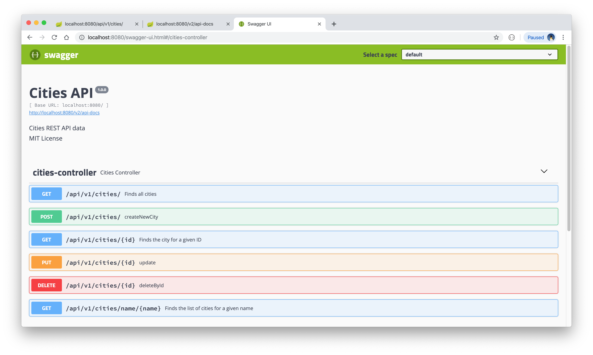
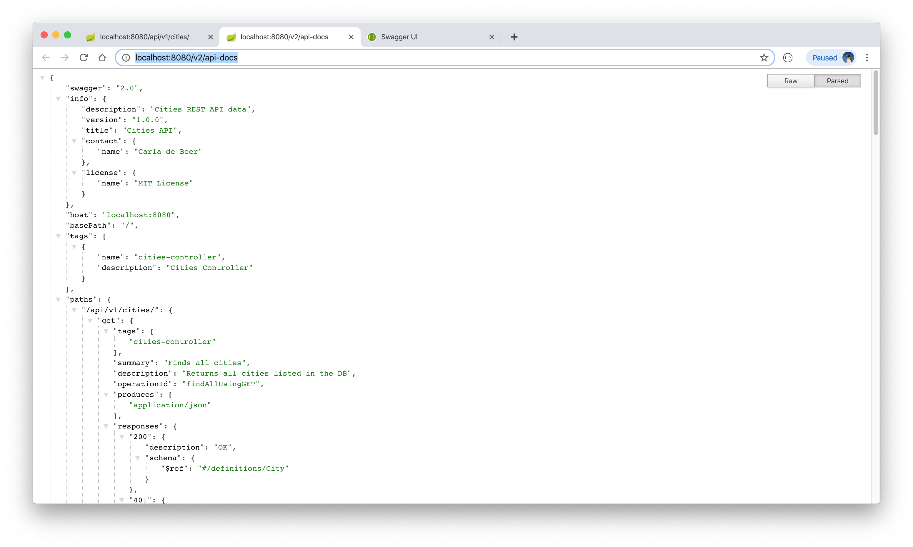
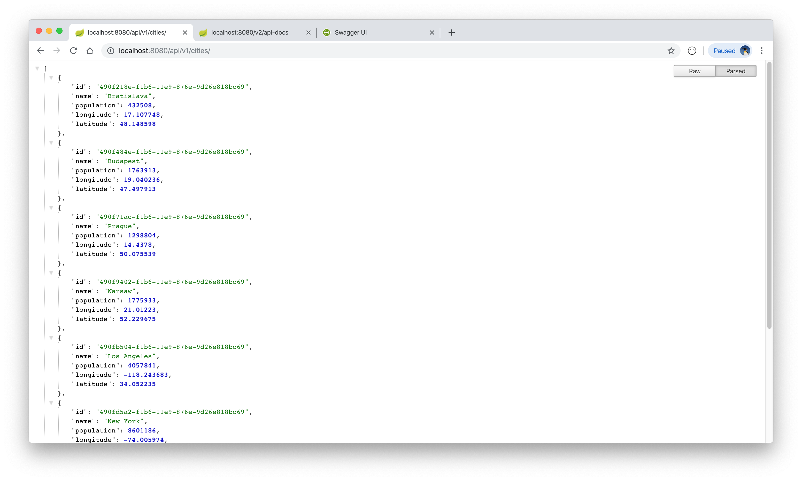

# Cities API

This is a Spring Boot API project that displays data related to cities. The city data is manipulated by means of standard CRUD calls, together with custom queries. The data is contained within a MySQL database.

The project is built with Java 11 and Maven. Swagger2 is used to generate the API documentation.


## Getting started

* Create a MySQL database, activate its server, and populate it with data via the following SQL query:

    ```
    DROP TABLE IF EXISTS cities;

    CREATE TABLE cities (
    `id` BINARY(16) NOT NULL primary key,
    `name` VARCHAR(255),
    `country_code` VARCHAR(2),
    `population` INT,
    `latitude` DOUBLE,
    `longitude` DOUBLE) ENGINE=InnoDB DEFAULT CHARSET=utf8;

    INSERT INTO cities values(unhex(replace(uuid(),'-','')), 'Bratislava', 'SK', 432508, 48.148598, 17.107748);
    INSERT INTO cities values(unhex(replace(uuid(),'-','')), 'Budapest', 'HU', 1763913, 47.497913, 19.040236);
    INSERT INTO cities values(unhex(replace(uuid(),'-','')), 'Prague', 'CZ', 1298804, 50.075539, 14.437800);
    INSERT INTO cities values(unhex(replace(uuid(),'-','')), 'Warsaw', 'PL', 1775933, 52.229675, 21.012230);
    INSERT INTO cities values(unhex(replace(uuid(),'-','')), 'Los Angeles', 'US', 4057841, 34.052235, -118.243683);
    INSERT INTO cities values(unhex(replace(uuid(),'-','')), 'New York', 'US', 8601186, 40.712776, -74.005974);
    INSERT INTO cities values(unhex(replace(uuid(),'-','')), 'Edinburgh', 'GB', 530741, 55.953251, -3.188267);
    INSERT INTO cities values(unhex(replace(uuid(),'-','')), 'Berlin', 'DE', 3556792, 52.520008, 13.404954);
    ```

## Getting started

Download or clone the project. Add a database username and password to the `src/main/resources/application.properties` file. 
Build the project with the command `mvn clean install` and start the project server by running the command `mvn spring-boot:run`. The API can be called with any of the following cURL CRUD-based requests:

* GET/READ:

  * ```curl -i http://localhost:8080/api/v1/cities/```
  * ```curl -i http://localhost:8080/api/v1/cities/<id>```
  * ```curl -i http://localhost:8080/api/v1/cities/name/<cityName>```


* CREATE/ADD:

  * ```curl -i -H "Content-Type: application/json" -X POST -d '{"name": "Paris","population": 12532901,"longitude": 0.0, "latitude": 0.0}' http://localhost:8080/api/v1/cities/```


* UPDATE/EDIT:

  * ```curl -i -H "Content-Type: application/json" -X PUT -d '{"name": "Paris","population": 12532901,"longitude": 48.864716, "latitude": 2.349014}' http://localhost:8080/api/v1/cities/<id>```


* DELETE:

  * ```curl -i -X DELETE http://localhost:8080/api/v1/cities/<id>```

Alternatively, import and run the Postman test collection. These can be found under `src/test/resources/com/cadebe/cities_api/Postman\ tests/Cities\ API.postman_collection.json`.


## API Documentation

API documentation is provided by means of Swagger2, which can be opened in the browser with the following urls:

* http://localhost:8080/v2/api-docs
* http://localhost:8080/swagger-ui.html#/

<p align="center">
  
  
  
</p>