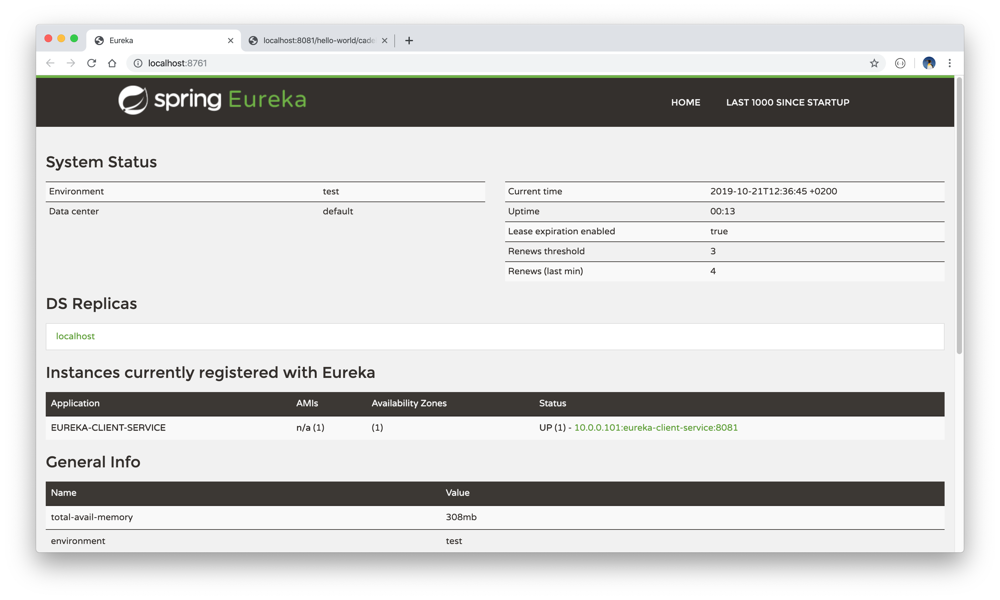

# Eureka Server Project

This is a simple Spring Boot microservices project that registers a client application with a Eureka server. 

The project is built with Java 11 and Maven. 

## Getting started

Build each module with the command `mvn clean install` and run the Eureka service first by running the command `mvn spring-boot:run`, followed by the client application, and check that the Eureka server correctly shows the client application as being registered.

  

