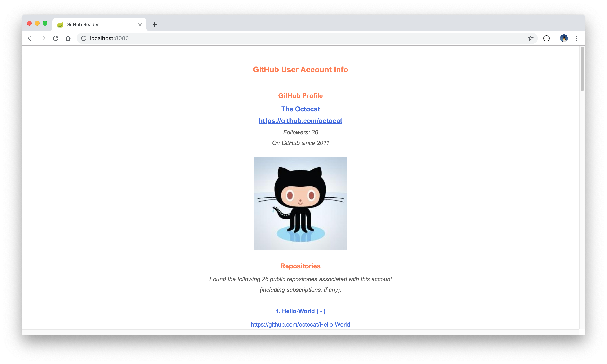
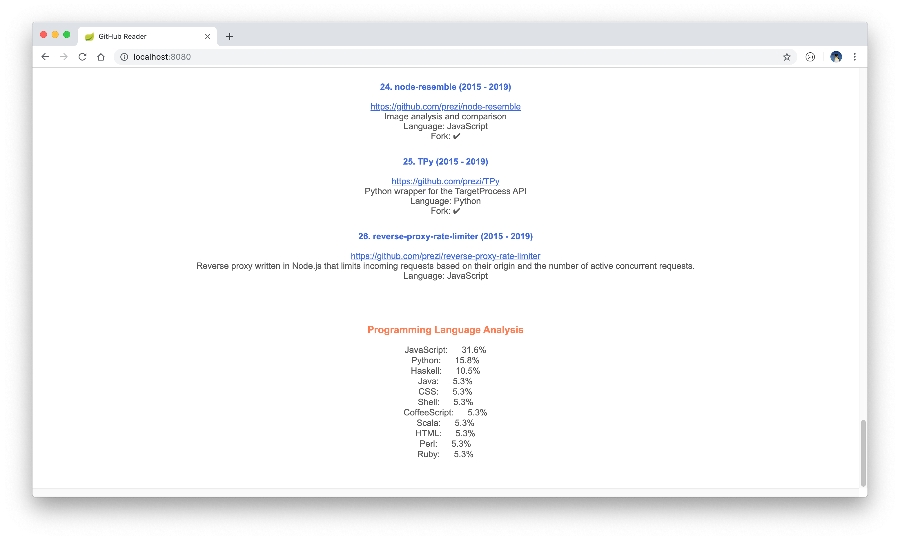

# GitHub Reader

A web-based reader to display GitHub repository information for a specific GitHub user given a valid GitHub account name. Note, all the information displayed in the Reader is information that has been made publicly accessible. No data regarding private repositories will be displayed.

The project was built with Spring Boot, ThymeLeaf, Java 11 and Maven.

This project makes use of the [GitHub Developer API](https://developer.github.com/v3/) to access the GitHub data.

## Getting started

* Download or clone the project. 
* Add a database username and password to the `src/main/resources/application.properties` file. 
* Build the project with the command `mvn clean install` and start the project server by running the command `mvn spring-boot:run`. * The landing page can then be viewed in a browser via the link: `http://localhost:8080/`. Enter a valid GitHub account name, when prompted, in order to display the relevant user repository information. Information displayed includes the following:
	* The user name and short profile synopsis.
	* A hyperlink to the user's repository.
	* An associated avatar (if one is available).
	* A confirmation of the total number of repositories found for this user.
	* A summary of the repositories found. This list also includes subscriptions, where applicable.
	* A brief analysis of the programming languages used in these repositories.

Alternatively, import and run the Postman test collection. These can be found under `src/test/resources/com/cadebe/github_reader/Postman\ Tests/GitHub\ Reader.postman_collection.json`.

  
  

