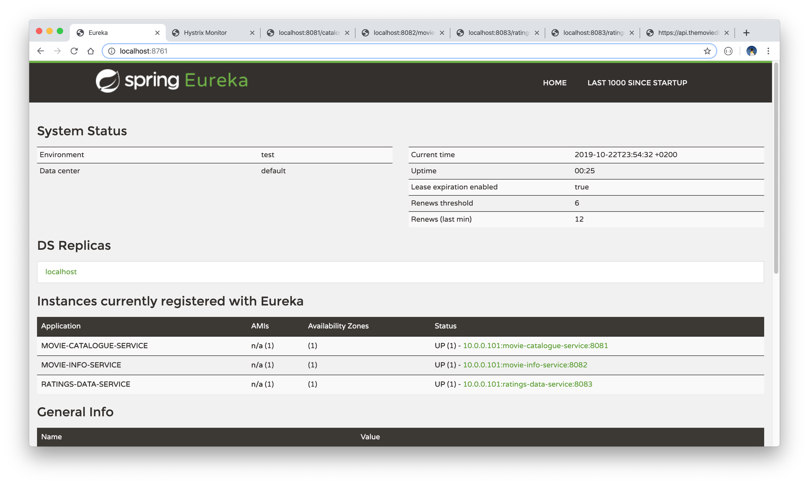

# Movie Catalogue API

This is a Spring Boot microservices API project displaying movie data with reference to the ratings provided by a user. The data is both locally stored, and obtained from the external API [The movie DB](https://www.themoviedb.org/documentation/api).

The project is based on the Java Brains [Spring Boot Microservices Levels 1 & 2](https://www.youtube.com/watch?v=y8IQb4ofjDo&list=PLqq-6Pq4lTTZSKAFG6aCDVDP86Qx4lNas) tutorials, and is built with Java 11 and Maven. Service discovery is provided by a Eureka server and Hystrix is used for circuit breaker.

## Microservices

The microservices contained within this project are the following:
* `movie-catalogue-service`: The main API service (port 8081).
* `movie-info-service`: Calls the external movie API for movie titles and descriptions (port 8082).
* `ratings-data-service`: Provides the user ratings (port 8083).

## Getting started

* Download or clone the project. Obtain a developer API key from [The movie DB](https://www.themoviedb.org/documentation/api), and add this to the properties file for the `movie-info-service`.

* Build the modules with the command `mvn clean install` and start the project server by running the command `mvn spring-boot:run`.

* The Eureka server can be called in a browser with the URL `http://localhost:8761/`.
* The Hystrix Dashboard can be viewed with the URL `http://localhost:8081/hystrix`.
* The movie data and user ratings can be viewed with the URL `http://localhost:8081/catalogue/foo`.

## TODO

- [ ] Add exception handling.
- [ ] Add a database connection.

  
  
  
  

