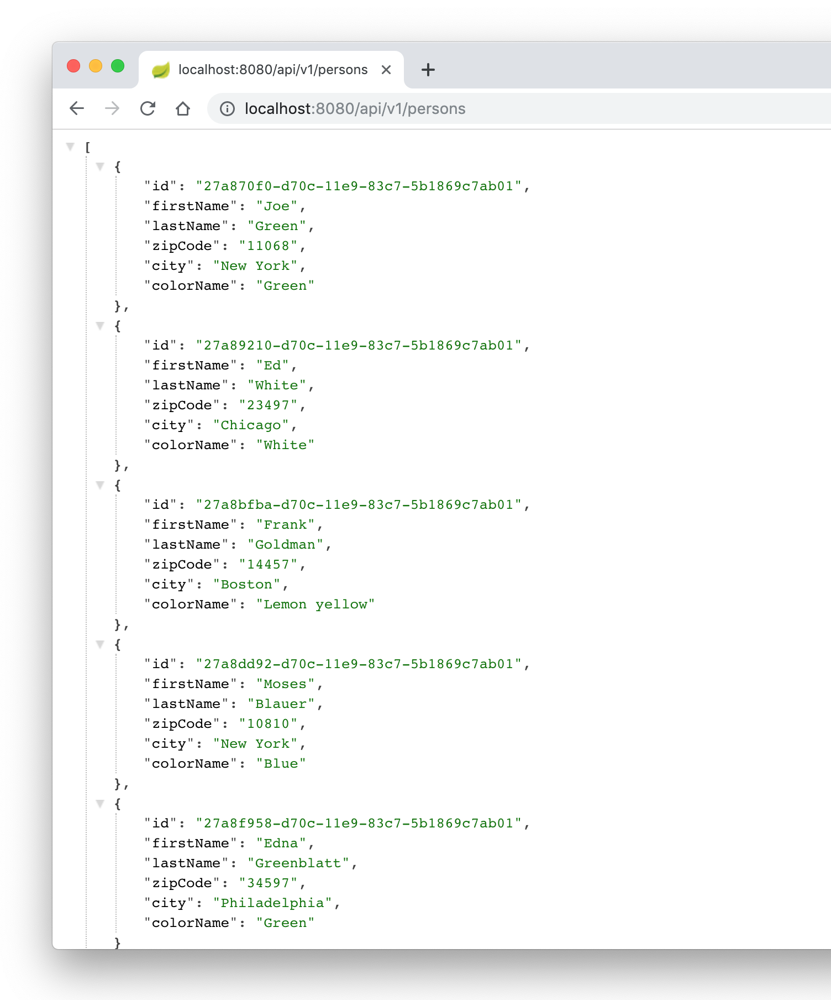
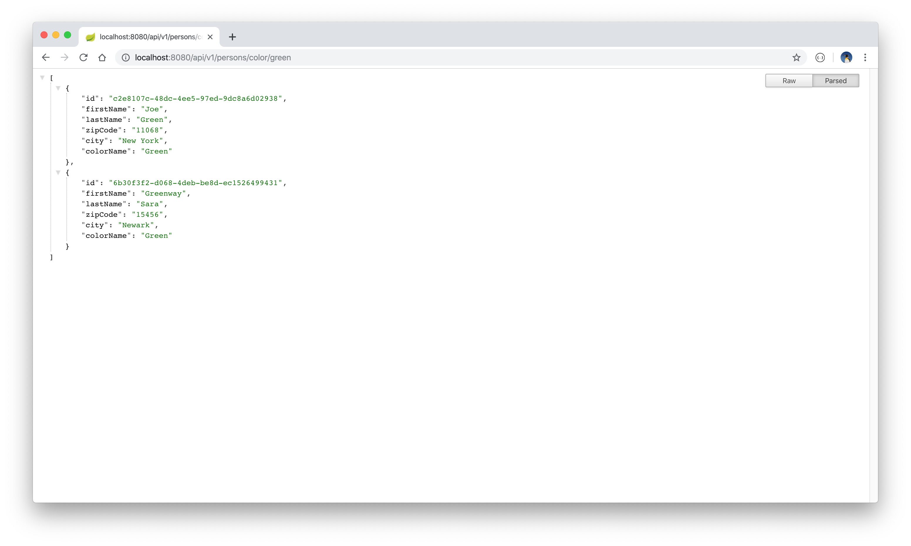

# Persons API

This is a Spring Boot API project that performs the standard set of CRUD calls on a list of person data. The project allows for the option of loading the data either from a locally stored CSV file or from a MySQL database.

The project is built with Java 11 and Maven. Units tests were built with the Spock testing framework. Automated Postman advanced REST client tests are also provided.

## Mock data

By default, the project is configured to read mock data from a locally stored CSV file. This file is located under `src/main/resources/sourceData/mockData.csv`. All CRUD calls operate on this file.
The file, in the format ``<last_name>, <first_name>, <zip_code city>, <color_code>``, is initially populated with the following data:

```
Green    ,Joe     ,11068  New York   ,1,
Sara     ,Greenway,15456  Newark     ,1,
Redstone ,Sara    ,28340  Seattle    ,3,
Weissmann,Peter   ,45630  Minneapolis,6,
Blauert  ,Ed      ,23497  Chicago    ,5,

```

The `color_code` field denotes a colour value associated with each entry. The colour values are as follows:

```
0: "Blue"
1: "Green"
2: "Purple"
3: "Red"
4: "Lemon yellow"
5: "Turquoise"
6: "White"
```

### MySQL database access

To swap the option of locally stored mock data out for the MySQL database access, carry out the following steps:

* Inside the PersonService class, change the `@Qualifier()` property from `"mockDao"` to `"JPA_Dao"`.
* Create a MySQL database, activate its server, and populate it with data via the following SQL query:

        DROP TABLE IF EXISTS person;

        CREATE TABLE person (
        `id` BINARY(16) NOT NULL primary key,
        `first_name` VARCHAR(255),
        `last_name` VARCHAR(255),
        `zip_code` VARCHAR(255),
        `city` VARCHAR(255),
        `color_code` INT) ENGINE=InnoDB DEFAULT CHARSET=utf8;

        INSERT INTO person values(unhex(replace(uuid(),'-','')), 'Joe', 'Green', '11068', 'New York', 1);
        INSERT INTO person values(unhex(replace(uuid(),'-','')), 'Ed', 'White', '23497', 'Chicago', 6);
        INSERT INTO person values(unhex(replace(uuid(),'-','')), 'Frank', 'Goldman', '14457', 'Boston', 4);
        INSERT INTO person values(unhex(replace(uuid(),'-','')), 'Moses', 'Blauer', '10810', 'New York', 0);
        INSERT INTO person values(unhex(replace(uuid(),'-','')), 'Edna', 'Greenblatt', '34597', 'Philadelphia', 1);

* Update the database information in `main/resources/application.properties` to correctly display the database url, password and username.

## Getting started

Download or clone the project. Add a database username and password to the `src/main/resources/application.properties` file. 
Build the project with the command `mvn clean install` and start the project server by running the command `mvn spring-boot:run`. The API can be called with any of the following cURL CRUD-based requests:

* GET/READ:

  * ```curl -i http://localhost:8080/api/v1/persons/```
  * ```curl -i http://localhost:8080/api/v1/persons/<personId>```
  * ```curl -i http://localhost:8080/api/v1/persons/color/<colorName>```

  The third GET-call provides a list of all the persons associated with a particular colour where the given colour name is one of those listed above).

* UPDATE/EDIT:

  * ```curl -i -H "Content-Type: application/json" -X PUT -d '{"firstName": "Greenway","lastName": "Sara","zipCode": "15456","city":"Newark","color": 5}' http://localhost:8080/api/v1/persons/<personId>```


* CREATE/ADD:

  * ```curl -i -H "Content-Type: application/json" -X POST -d '{"firstName":"Carmen","lastName":"Redway","zipCode":"75450","city":"Phoenix","color": 3 }' http://localhost:8080/api/v1/persons/```


* DELETE:

  * ```curl -i -X DELETE http://localhost:8080/api/v1/persons/<personId>```

Alternatively, import and run the Postman test collection. These can be found under `src/test/resources/com/cadebe/persons_api/Postman\ tests/Persons\ API.postman_collection.json`.

## Troubleshooting
If using the locally stored dataset and the Spring Boot server runs into errors at the time of starting up, check the CSV file for (syntax) errors.


<p align="center">
  
  
</p>
