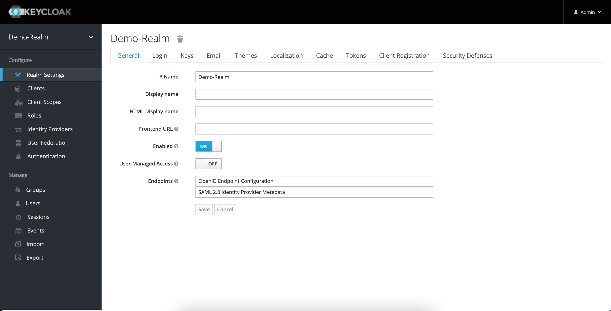
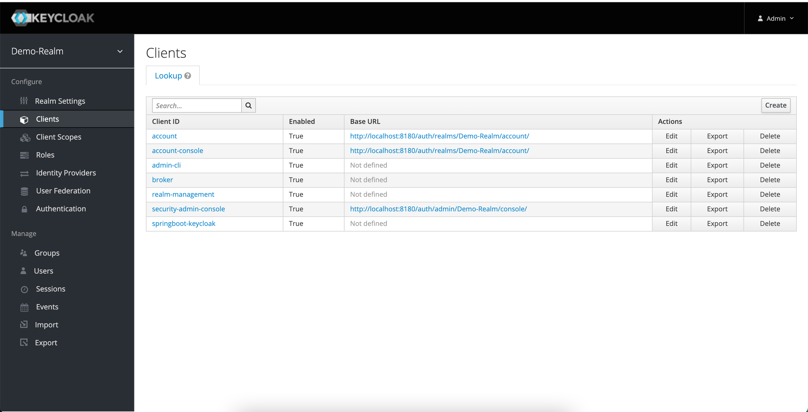
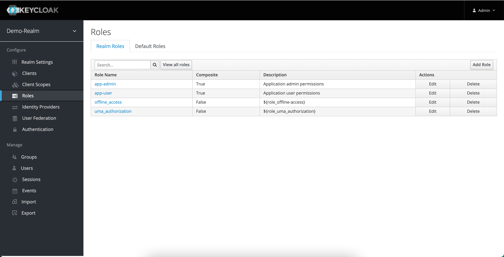
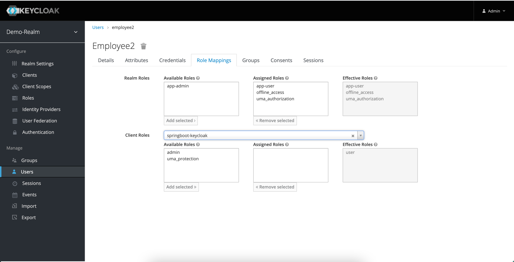

# Springboot Keycloak Demp Project

Keycloak as identity and access management solution integrated with a basic Spring Boot project.

## Requirements

* Java 11
* Spring Boot 2.4.2
* Maven 3.6.3
* JUnit 5
* A Keycloak Server

## Getting started

Start the Keycloak server and configure the realm, client, roles and users as follows:

<p align="center">
  
  
  
  
  
</p>

Add the client credentials secret value to the application properties file, or add as command line parameter at run time.

Generate tokens for the two users, `employee1` and `employee1`:
<br/>
```curl -X POST 'http://localhost:8180/auth/realms/Demo-Realm/protocol/openid-connect/token' \
--header 'Content-Type: application/x-www-form-urlencoded' \
--data-urlencode 'grant_type=password' \
--data-urlencode 'client_id=springboot-keycloak' \
--data-urlencode 'client_secret=<CLIENT_ID_SECRET>' \
--data-urlencode 'username=<USER_NAME>' \
--data-urlencode 'password=<USER_PASSWORD'
```

Run the Spring Boot project and test the API with the following cURL CRUD-based requests:
<br/>
*```curl -i http://localhost:8000/test/anonymous```
*```curl -X GET 'http://localhost:8000/test/admin' --header 'Authorization: bearer <TOKEN>'```
*```curl -X GET 'http://localhost:8000/test/all-user' --header 'Authorization: bearer <TOKEN>'```
*```curl -X GET 'http://localhost:8000/test/user' --header 'Authorization: bearer <TOKEN>'```


